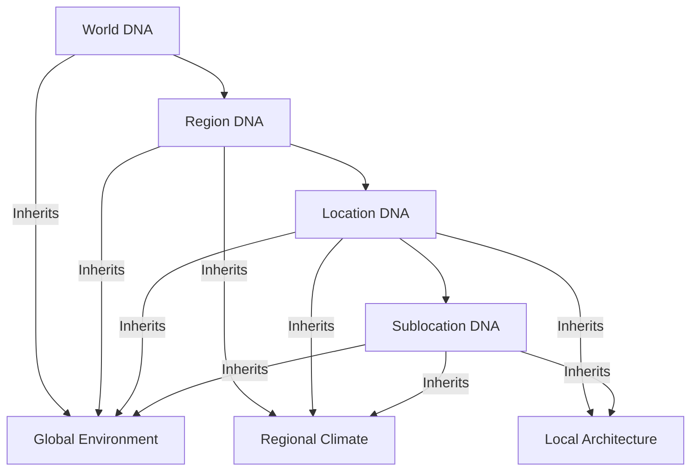
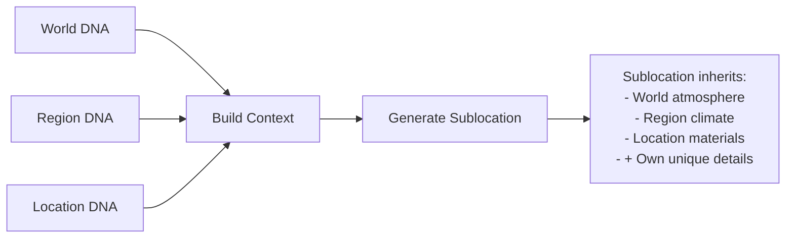
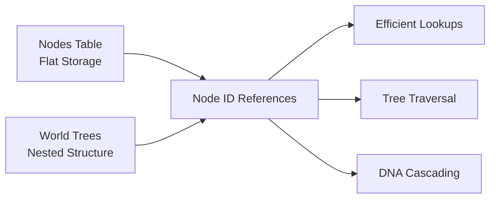
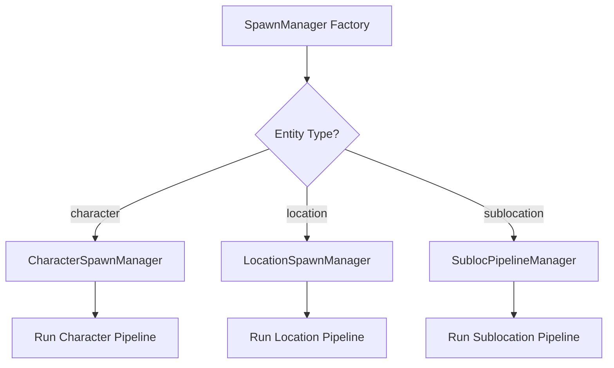
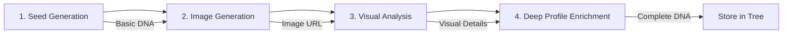
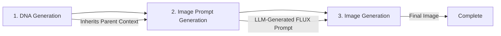
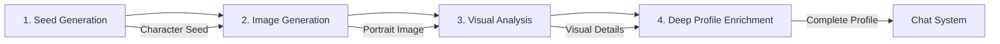

# Morfeum World Creation & Navigation System

## Table of Contents
1. [System Overview](#system-overview)
2. [World DNA Architecture](#world-dna-architecture)
3. [Cascading Context System](#cascading-context-system)
4. [NavigatorAI - Semantic Navigation](#navigatorai---semantic-navigation)
5. [Storage Architecture](#storage-architecture)
6. [Focus System](#focus-system)
7. [Generation Pipelines](#generation-pipelines)
8. [Node Types & Hierarchies](#node-types--hierarchies)
9. [Character Pipeline](#character-pipeline)

---

## System Overview

Morfeum implements a sophisticated world creation and navigation system that combines:

- **Hierarchical World DNA** with cascading context inheritance
- **LLM-powered NavigatorAI** for semantic spatial navigation
- **Tree-based storage** with flat node storage + nested tree references
- **Multi-pipeline generation** for different entity types
- **Focus system** for tracking user viewpoint and perspective
- **Sublocation spawning** with parent context inheritance

### Core Philosophy

The system is built on the principle of **DNA inheritance** - each level of the world hierarchy (World → Region → Location → Sublocation) stores only its own unique data, while inheriting environmental and atmospheric properties from parent nodes. This creates consistent, believable worlds where every location feels like it belongs.

---

## World DNA Architecture

### Hierarchical Structure



### Node Types

#### 1. World Node (Root Level)
The foundational DNA that defines the entire world's character.

**Contains:**
- **Meta**: World name and slug
- **Semantic**: Environment type, dominant materials, atmosphere, architectural tone, genre, mood baseline, palette bias
- **Spatial**: Light behavior patterns
- **Profile**: Colors/lighting, symbolic themes, search description

**Purpose**: Establishes the fundamental "rules" of the world - what materials exist, what the overall atmosphere feels like, what architectural styles are present.

#### 2. Region Node (Zone Level)
Defines distinct geographic or thematic areas within the world.

**Contains:**
- **Meta**: Region name and slug
- **Semantic**: Regional environment, climate, weather patterns, architecture style, mood, palette shifts
- **Spatial**: Dominant view axis
- **Profile**: Regional colors/lighting, symbolic themes, search description

**Purpose**: Adds regional variation while maintaining world consistency. A single world might have arctic regions, tropical zones, or urban areas.

#### 3. Location Node (Site Level)
Specific places within regions that users can visit and explore.

**Contains:**
- **Meta**: Location name and slug
- **Semantic**: Terrain/interior type, structures, vegetation, fauna, lighting, weather/air, atmosphere, mood, color palette, soundscape, genre
- **Spatial**: Scale (height, width), placement (subject position, camera anchor), orientation (light direction, wind), connectivity (links to other locations)
- **Profile**: Looks, colors/lighting, atmosphere, materials, mood, sounds, symbolic themes, air particles, fictional/copyright flags, search description
- **Visual Anchors**: Dominant elements, spatial layout, surface materials, color mapping, unique identifiers

**Purpose**: The primary exploration unit. Each location is a distinct scene with its own visual identity while respecting parent world/region rules.

#### 4. Sublocation Node (Detail Level)
Interior spaces or close-up views within locations.

**Contains:**
- **Meta**: Sublocation name and optional slug
- **Semantic**: Environment, terrain/interior, structures, vegetation, fauna, lighting, weather/air, atmosphere, mood, color palette, soundscape
- **Spatial**: Scale (ceiling height, room dimensions), placement, orientation, connectivity
- **Profile**: Looks, colors/lighting, atmosphere, materials, mood, sounds, symbolic themes, air particles, fictional/copyright flags, search description

**Purpose**: Allows users to "zoom in" on specific areas or enter buildings. Generated dynamically when users navigate "inside" or "closer to" objects.

---

## Cascading Context System

### How DNA Inheritance Works

When generating a new child node, the system **cascades** DNA from all parent nodes to provide context:



### Example: Generating "Lighthouse Interior"

1. **World DNA provides**: "Storm-lashed coastal world, Gothic architecture, grey stone dominant"
2. **Region DNA provides**: "Northern cliffs, perpetual storms, cold winds"
3. **Location DNA provides**: "Stone lighthouse, circular tower, beacon at top"
4. **Sublocation generates**: Interior chamber inheriting storm sounds, stone walls, Gothic arches, but adding spiral stairs, lantern room details

### Visual Anchors for Consistency

Each location stores **visual anchors** to ensure revisiting produces consistent imagery:

- **Dominant Elements**: 3-5 most prominent visual features (with size/position)
- **Spatial Layout**: Structure, dimensions, entry points, focal centers
- **Surface Material Map**: Materials mapped to specific surfaces
- **Color Mapping**: Colors mapped to locations with coverage details
- **Unique Identifiers**: 2-4 distinctive visual "fingerprints"

**The "Room Test"**: If you leave a location and return, it should not only *feel* similar but *look* the same - same layout, same distinctive features, same materials in the same places.

---

## NavigatorAI - Semantic Navigation

### Overview

NavigatorAI is an LLM-powered system that interprets natural language commands and decides whether to:
1. **Move** to an existing location
2. **Generate** a new location when none exists

### How It Works

```mermaid
flowchart TD
    A[User Command: "go to marina"] --> B[NavigatorAI]
    B --> C{Analyze Intent}
    C --> D[Current Location Context]
    C --> E[Available Nodes]
    C --> F[Spatial Relationships]
    
    D --> G{Location Exists?}
    E --> G
    F --> G
    
    G -->|Yes| H[Action: MOVE<br/>targetNodeId: marina-123]
    G -->|No| I[Action: GENERATE<br/>name: "Marina"<br/>relation: nearby]
    
    H --> J[Update Focus to Target]
    I --> K[Start Location Spawn]
```

### Natural Language Understanding

NavigatorAI understands fuzzy, imprecise commands:

- **"go inside"** → Finds or generates interior sublocation
- **"back to the beach"** → Navigates to parent or sibling node
- **"explore the tower"** → Generates new location if tower doesn't exist
- **"go closer to machine"** → Generates detail view sublocation with tight framing
- **"exit"** / **"leave"** → Returns to parent location

### Perspective Inference

NavigatorAI infers perspective from commands:

- **"go to marina"** (no "inside") → Exterior view (`scale_hint: "site"`)
- **"go inside marina office"** → Interior view (`scale_hint: "interior"`)
- **"approach the machine"** → Close-up detail view (`scale_hint: "detail"`)

### Scale Hints

The system uses scale hints to control perspective and framing:

- **macro**: Wide world view
- **area**: Regional view
- **site**: Exterior location view (buildings, landscapes)
- **interior**: Indoor spaces, rooms
- **detail**: Close-up of objects, tight framing

### Spatial Context

NavigatorAI receives rich spatial context:

- **Current Focus**: Where user is viewing from (node_id, perspective, viewpoint, distance)
- **Current Location Details**: Visual anchors from current scene
- **Available Nodes**: All locations in the world with their relationships
- **Tree Traversal Data**: Parent/child/sibling relationships

### Search Descriptions

Each node has a **searchDesc** field with type prefix for semantic matching:

- **World**: `[World] Coastal megacity with rugged cliffs and stormy seas`
- **Region**: `[Region] Storm-lashed coastal area with dramatic cliffs`
- **Location - Exterior**: `[Location - Exterior] Stone lighthouse on cliff, has interior chambers`
- **Location - Interior**: `[Location - Interior] Indoor market hall with vendor stalls`
- **Sublocation - Interior**: `[Sublocation - Interior] Lighthouse chamber with spiral stairs`

These prefixes help NavigatorAI understand hierarchy and make intelligent navigation decisions.

---

## Storage Architecture

### Two-Table System

Morfeum uses a sophisticated two-table storage architecture:



### Nodes Table (Flat Storage)

**Key-Value Map**: `nodeId → Node`

Each node stores:
- **id**: Unique identifier
- **type**: `world` | `region` | `location` | `sublocation`
- **name**: Display name
- **dna**: Single-layer DNA (only this node's data, not parents')
- **imagePath**: Generated image URL
- **focus**: Optional focus state for viewpoint tracking

**Benefits**:
- O(1) lookup by ID
- Single source of truth for node data
- No duplication of DNA across children
- Easy to update individual nodes

### World Trees (Nested Structure)

**Array of Tree Roots**: Each world is a tree of ID references

Tree nodes contain:
- **id**: Reference to node in flat storage
- **type**: Node type
- **children**: Array of child tree nodes

**Benefits**:
- Efficient parent/child traversal
- Easy spatial node queries (siblings, descendants)
- Clear hierarchical relationships
- Supports multiple world trees simultaneously

### Example Storage

**Nodes Table**:
```
{
  "world-1": { type: "world", name: "Ethereal Nexus", dna: {...} },
  "region-1": { type: "region", name: "Northern Wastes", dna: {...} },
  "loc-1": { type: "location", name: "Lighthouse", dna: {...} },
  "subloc-1": { type: "sublocation", name: "Lighthouse Interior", dna: {...} }
}
```

**World Trees**:
```
[
  {
    id: "world-1",
    type: "world",
    children: [
      {
        id: "region-1",
        type: "region",
        children: [
          {
            id: "loc-1",
            type: "location",
            children: [
              { id: "subloc-1", type: "sublocation", children: [] }
            ]
          }
        ]
      }
    ]
  }
]
```

### Operations

**Get Cascaded DNA**:
1. Find tree containing target node
2. Traverse from root to target, collecting DNA at each level
3. Return merged context (world + region + location layers)

**Get Spatial Nodes** (for navigation):
1. Find current node in tree
2. Collect: self, ancestors (path to root), siblings, descendants
3. Return all spatially-related nodes

**Delete World Tree**:
1. Recursively collect all node IDs in tree
2. Delete all nodes from flat storage
3. Remove tree from world trees array
4. Clean up pins referencing deleted nodes

---

## Focus System

### Purpose

The Focus System tracks **where the user is viewing from** in the world node tree. This is essential for:
- NavigatorAI to understand current position
- Generating sublocations with correct viewpoint
- Maintaining spatial context during exploration

### FocusState Structure

Each location can have an associated focus state:

- **node_id**: Current node being viewed
- **perspective**: `exterior` | `interior` | `aerial` | `ground-level` | `elevated` | `distant`
- **viewpoint**: Free-text description of viewer position
- **distance**: `close` | `medium` | `far`

### How It's Used

**During Navigation**:
- User says "go closer to machine"
- Focus shows: `{ node_id: "factory-floor", perspective: "ground-level", distance: "medium" }`
- NavigatorAI generates sublocation with: `{ perspective: "ground-level", distance: "close" }`

**During Generation**:
- Focus state informs camera position for image generation
- "exterior" focus → wide landscape shots
- "interior" focus → room/chamber framing
- "elevated" focus → looking down perspective

### Initialization

When a location is generated, focus is initialized from the **viewContext** in the location's DNA:

- **perspective**: Captured from image analysis (exterior/interior/aerial/etc.)
- **focusTarget**: Main subject being viewed
- **distance**: How close the camera is
- **composition**: Viewer position description

---

## Generation Pipelines

### Overview

Morfeum has three specialized generation pipelines:

1. **Character Pipeline** - For NPCs and entities
2. **Location Pipeline** - For worlds, regions, and locations
3. **Sublocation Pipeline** - For interior spaces and detail views

### Factory Pattern



### Location Pipeline (4 Stages)



#### Stage 1: Seed Generation
**Input**: User prompt (e.g., "a storm-lashed lighthouse")
**Output**: Initial location seed

Generated fields:
- name
- looks (visual description)
- atmosphere
- mood
- renderInstructions
- scale_hint (inferred from prompt)
- classification (world vs region vs location)

**Purpose**: Quick initial conception of the location before committing to image generation.

#### Stage 2: Image Generation
**Input**: Location seed
**Output**: Generated image URL + prompt used

Process:
- Constructs detailed FLUX prompt from seed
- Uses appropriate filter (Landscape Overview for exteriors)
- Generates 16:9 landscape image
- Returns URL for further analysis

**Purpose**: Creates visual representation to ground subsequent analysis.

#### Stage 3: Visual Analysis
**Input**: Generated image + seed data
**Output**: Detailed visual analysis

Extracted details:
- looks (observed visual description)
- colorsAndLighting
- atmosphere
- vegetation/flora
- architecture
- animals/fauna
- mood
- **visualAnchors** (dominant elements, spatial layout, materials, colors, unique identifiers)

**Purpose**: Captures concrete visual details from the actual generated image.

#### Stage 4: Deep Profile Enrichment
**Input**: Seed + visual analysis + original user prompt
**Output**: Complete NodeDNA

Final DNA structure:
- looks
- colorsAndLighting
- atmosphere
- architectural_tone
- materials
- mood
- sounds
- visualAnchors (copied from analysis)
- searchDesc (with type prefix)
- fictional/copyright flags

**Purpose**: Creates final, complete DNA that combines user intent, seed conception, and observed visuals.

### Sublocation Pipeline (Simplified)



#### Key Differences from Location Pipeline

1. **No seed stage** - Uses inherited context from parent
2. **No visual analysis** - Generated DNA is final
3. **Two-step image process**:
   - Step 2a: LLM generates FLUX-optimized prompt
   - Step 2b: FLUX generates image from prompt

#### Context Inheritance

Sublocation pipeline receives:
- **sublocationName**: From NavigatorAI (e.g., "Lighthouse Interior")
- **parentNodeId**: Reference to parent location
- **cascadedContext**: Merged DNA from world → region → location
- **scaleHint**: Perspective (interior/detail)

The LLM uses cascaded context to ensure the sublocation:
- Matches parent atmosphere and mood
- Uses consistent materials and architecture
- Inherits environmental conditions (storm, lighting, etc.)
- Adds unique interior/detail elements

---

## Node Types & Hierarchies

### World Node (Root)

**Scale**: Entire fictional world or setting

**When Created**: 
- User requests new world ("create a cyberpunk metropolis")
- First location generation auto-creates world

**DNA Focus**:
- Dominant materials (stone, metal, wood, etc.)
- Overall atmosphere (oppressive, whimsical, grim, etc.)
- Architectural tone (Gothic, futuristic, organic, etc.)
- Genre (fantasy, sci-fi, historical, etc.)
- Mood baseline (melancholy, energetic, tense, etc.)
- Palette bias (warm, cool, saturated, muted, etc.)

**Example**: "Ethereal Nexus" - A storm-lashed coastal world with Gothic architecture, grey stone dominance, and perpetual twilight.

### Region Node (Zone)

**Scale**: Geographic or thematic area within world

**When Created**:
- World generation includes region(s)
- User explicitly requests regional variation

**DNA Focus**:
- Regional climate (arctic, tropical, temperate, etc.)
- Weather patterns (constant rain, dust storms, calm, etc.)
- Regional architecture style (refinement of world tone)
- Mood shifts from world baseline
- Palette shifts (regional color variations)

**Example**: "Northern Wastes" - Arctic region within Ethereal Nexus, perpetual blizzards, ice-encrusted structures.

### Location Node (Site)

**Scale**: Specific place users can visit

**When Created**:
- User requests location generation
- NavigatorAI determines new location needed

**DNA Focus**:
- Specific terrain or interior type
- Structures present (materials, colors, condition)
- Vegetation (types, density)
- Fauna (types, presence)
- Lighting (time of day, artificial light)
- Weather/air quality
- Detailed soundscape
- Visual anchors for consistency

**Example**: "Stormwatch Beacon" - Lighthouse on cliff in Northern Wastes, circular stone tower, beacon visible through storms.

### Sublocation Node (Detail)

**Scale**: Interior space or close-up view

**When Created**:
- User navigates "inside" a location
- User commands "go closer to" an object
- NavigatorAI determines detail view needed

**DNA Focus**:
- Interior/detail-specific environment
- Room dimensions or object framing
- Inherited materials and atmosphere
- Interior lighting conditions
- Air quality and particles
- Indoor soundscape

**Example**: "Lighthouse Interior" - Spiral staircase inside Stormwatch Beacon, stone walls echoing with wind, oil lamps flickering.

### Hierarchy Example

```
🌍 Ethereal Nexus (World)
├── ❄️ Northern Wastes (Region)
│   ├── 🏛️ Stormwatch Beacon (Location - Exterior)
│   │   ├── 🔦 Lighthouse Interior (Sublocation - Interior)
│   │   └── 🔍 Closer to Beacon Light (Sublocation - Detail)
│   └── 🏔️ Frozen Archives (Location - Exterior)
│       └── 📚 Archive Hall (Sublocation - Interior)
└── 🌊 Southern Harbors (Region)
    └── ⚓ Merchant's Marina (Location - Exterior)
```

---

## Character Pipeline

### Overview

The character generation pipeline is similar to location generation but optimized for creating NPCs and entities.

### Character Pipeline (4 Stages)



#### Stage 1: Character Seed Generation
**Input**: User prompt (e.g., "a wise old wizard")
**Output**: Character seed

Generated fields:
- name
- looks (physical description)
- wearing (clothing/equipment)
- personality (core traits)
- presence (how they carry themselves)
- setting (context where they exist)

#### Stage 2: Character Image Generation
**Input**: Character seed
**Output**: Character portrait

- Uses "Half Portrait" filter (waist-up framing)
- Generates character image from seed description
- Portrait format optimized for chat interface

#### Stage 3: Visual Analysis
**Input**: Generated portrait + seed
**Output**: Detailed visual analysis

Extracted details:
- face (facial features, expression)
- hair (style, color, texture)
- body (build, posture)
- specificDetails (unique features, accessories)

#### Stage 4: Deep Profile Enrichment
**Input**: Seed + visual analysis + original prompt
**Output**: Complete character profile (16 fields)

Final profile:
- name, looks, wearing, face, body, hair, specificDetails
- style (aesthetic presentation)
- personality (expanded traits)
- voice (tone, accent, speech patterns)
- speechStyle (how they talk)
- gender, nationality
- fictional/copyright flags
- tags (for categorization)

### Chat System Integration

After generation, characters are available for conversation:

1. **Initial System Prompt**: Generated from seed data
2. **Enhanced System Prompt**: Automatically upgraded when deep profile completes
3. **Character Impersonation**: LLM impersonates character using profile
4. **Message History**: Persistent conversation with each character

---

## Advanced Features

### Interior/Exterior Perspective System

The system automatically infers and maintains correct perspective:

**Flow**:
```
User Command → NavigatorAI → scale_hint → DNA Generation → Image Prompt Selection
```

**Example**:
- User: "go to marina"
- NavigatorAI: Infers `scale_hint: "site"` (exterior keyword)
- DNA: Creates outdoor DNA with `terrain_type` field
- Image: Uses `locationImageGeneration` (outdoor prompt)
- Result: Harbor view with boats and docks

### Distance-Based Navigation

Users can zoom in and out naturally:

**Closer**:
- "go closer to machine" → Detail sublocation, tight framing
- Target object fills 70%+ of frame
- Inherits parent atmosphere

**Further/Back**:
- "step back" → Return to parent node (wider view)
- Backend auto-fills parent ID from tree traversal

### Multi-View Preparation (Optional)

Infrastructure for directional views:

- Generate text descriptions for north/south/east/west views
- Lazy image generation (only when user looks in direction)
- Uses fast LLM model for text (~1-2 seconds)
- Optional feature, commented out by default

### World Tree Management

**Auto-Load on Startup**:
- All pinned worlds load recursively
- Children appear in ChatTabs with indentation
- Tree structure preserved across page refresh

**Cascade Deletion**:
- Deleting world removes entire tree
- Smart confirmation shows node count
- Prevents orphaned nodes

**Multiple Worlds**:
- Store multiple world trees simultaneously
- Each tree independent and isolated
- Easy world switching

---

## Best Practices

### For World Creation

1. **Start Broad**: Begin with world-level concepts, let regions and locations refine
2. **Consistent Tone**: Ensure architectural_tone cascades appropriately
3. **Visual Anchors**: Always generate visual anchors for revisitable locations
4. **Search Descriptions**: Use clear type prefixes for NavigatorAI understanding

### For Navigation

1. **Natural Commands**: Use everyday language ("go inside", "back", "closer")
2. **Trust NavigatorAI**: Let it decide move vs generate actions
3. **Perspective Keywords**: Use "inside" for interiors, plain "go to" for exteriors
4. **Distance Modifiers**: Use "closer", "approach", "step back" for zoom control

### For DNA Design

1. **Single Responsibility**: Each node stores only its layer, not parents'
2. **Inherit Don't Duplicate**: Rely on cascading for shared properties
3. **Concrete Details**: Visual anchors should be specific, not generic
4. **Searchable**: Write search descriptions humans would naturally use

---

## Technical Architecture Summary

### Key Components

1. **SpawnManager** (Factory): Routes to entity-specific pipeline managers
2. **LocationSpawnManager**: Handles 4-stage location generation
3. **CharacterSpawnManager**: Handles character generation with chat integration
4. **SublocPipelineManager**: Simplified 3-stage sublocation generation
5. **NavigatorAI Service**: LLM-powered semantic navigation
6. **locationsSlice** (Storage): Two-table architecture (nodes + trees)
7. **Focus System**: Viewpoint tracking utilities

### Data Flow

```
User Input → SpawnManager → Pipeline Manager → MZOO AI Services → SSE Events → Frontend Store → UI Update
```

### SSE Events

Real-time progress updates:
- `spawn:seed-complete`
- `spawn:image-complete`
- `spawn:analysis-complete`
- `spawn:profile-complete`
- `spawn:sublocation-dna-complete`
- `spawn:sublocation-image-prompt-complete`
- `spawn:sublocation-image-complete`
- `spawn:sublocation-complete`

---

## Conclusion

Morfeum's world creation and navigation system represents a sophisticated approach to procedural world building. By combining:

- **Hierarchical DNA inheritance** for consistency
- **LLM-powered navigation** for natural interaction
- **Tree-based storage** for efficient queries
- **Visual anchors** for reproducible imagery
- **Multi-stage pipelines** for rich generation

The system creates believable, explorable worlds that feel coherent while remaining flexible for player-driven exploration. The cascading context ensures every generated location respects its place in the world hierarchy, while NavigatorAI allows natural language navigation that feels intuitive and responsive.
