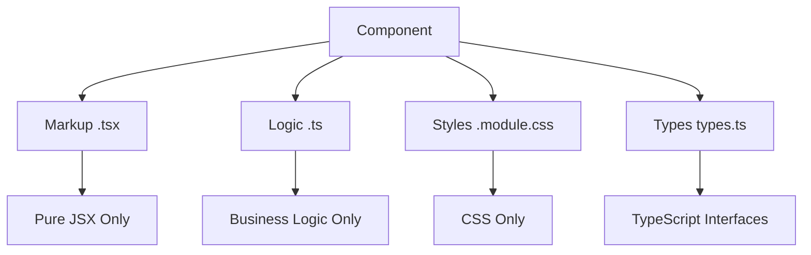

# System Patterns

## Architecture Overview
Morfeum follows a strict component-based architecture with clear separation of concerns and design system integration.

## Component Architecture Patterns

### Strict Separation Rules


### Component Size Limits
- **Maximum**: 300 lines per file
- **Minimum**: 50 lines for substantial components
- **Index files**: 2-15 lines for exports
- **CSS modules**: As needed for styling complexity

### File Organization Pattern
```
ComponentName/
├── ComponentName.tsx      # Pure JSX markup
├── useComponentLogic.ts   # Pure business logic
├── ComponentName.module.css # Pure CSS styles
├── types.ts              # TypeScript interfaces
└── index.ts              # Public exports
```

## Design System Integration

### Token Usage Pattern
- **Never**: Hardcode colors, spacing, or sizes
- **Always**: Use CSS custom properties (var(--token-name))
- **Consistent**: Follow design token naming conventions

### Component Pattern
```typescript
// Component follows strict separation
import { useComponentLogic } from './useComponentLogic';
import styles from './Component.module.css';

export function Component() {
  const { state, handlers, computed } = useComponentLogic();
  
  return (
    <div className={styles.container}>
      {/* Pure JSX only - no logic here */}
    </div>
  );
}
```

## State Management Patterns

### Zustand Slice Pattern
```typescript
// 50-150 lines per slice
interface SliceState {
  // State interface
}

interface SliceActions {
  // Action creators
}

export const createSlice = () => {
  // Slice implementation
};
```

### Cross-Slice Communication
- Use `get()` for immediate access
- Use `getState()` for current state
- Side-effects in hooks, not slices

## Icon Management Pattern

### Centralized Export Pattern
```typescript
// @/icons/index.ts - Only export used icons
export { IconLoader2 } from '@tabler/icons-react';
// Add new icons as needed - never import directly
```

### Usage Pattern
```typescript
import { IconLoader2 } from '@/icons';
// Never import directly from @tabler/icons-react
```

## Import Patterns

### Path Alias Usage
```typescript
// Correct
import { Button } from '@/components/ui';
import { IconLoader2 } from '@/icons';

// Incorrect
import { Button } from '../../../components/ui';
import { IconLoader2 } from '@tabler/icons-react';
```

### Component Import Pattern
```typescript
// Unified imports from UI components
import { Button, Card, Icon } from '@/components/ui';
import { IconHome } from '@/icons';
```

## CSS Architecture Patterns

### CSS Modules Only
- **Always**: Use .module.css files
- **Never**: Use global CSS classes
- **Consistent**: Follow BEM-like naming within modules

### Design Token Integration
```css
.component {
  background-color: var(--color-bg);
  padding: var(--spacing-md);
  border-radius: var(--radius-md);
}
```

## TypeScript Patterns

### Interface Organization
```typescript
// types.ts - Component interfaces
export interface ComponentProps {
  // Props interface
}

export interface ComponentLogicReturn {
  // Logic return interface
}
```

### Type Safety Rules
- **Always**: Export TypeScript interfaces
- **Never**: Use `any` type
- **Consistent**: Use proper generic typing

## Build and Performance Patterns

### Tree Shaking Optimization
- Export only what's used
- Avoid large barrel exports with unused items
- Use dynamic imports for code splitting when appropriate

### Bundle Optimization
- CSS Modules prevent style conflicts
- Icon optimization through selective exports
- Component lazy loading for large features

## Development Workflow Patterns

### Component Development Flow
1. Create component folder structure
2. Implement logic hook first
3. Create markup component
4. Add CSS module styles
5. Export from index file
6. Update UI components index

### Quality Assurance
- All components under 300 lines
- Strict separation of concerns
- Design token usage
- TypeScript type safety
- Build verification

## Error Handling Patterns

### Component Error Boundaries
- Wrap components in error boundaries
- Provide fallback UI for component failures
- Log errors appropriately

### API Error Handling
- Centralized error handling in logic hooks
- Consistent error state management
- User-friendly error messages

## Testing Patterns (Future)
- Component unit tests with React Testing Library
- Logic hook testing in isolation
- Integration tests for component interactions
- Type checking as compile-time testing

## Documentation Patterns

### Component Documentation
- Clear prop interface documentation
- Usage examples in component comments
- Storybook integration for visual documentation

### Pattern Documentation
- Document architectural decisions
- Maintain pattern consistency
- Update documentation as patterns evolve
