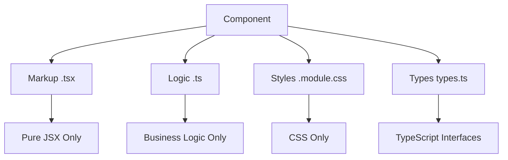

# System Patterns

## Architecture Overview
Morfeum follows a strict component-based architecture with clear separation of concerns and design system integration for both frontend and backend.

## Frontend Architecture Patterns

### Component Architecture Patterns

### Strict Separation Rules


### Component Size Limits
- **Maximum**: 300 lines per file
- **Minimum**: 50 lines for substantial components
- **Index files**: 2-15 lines for exports
- **CSS modules**: As needed for styling complexity

### File Organization Pattern
```
ComponentName/
├── ComponentName.tsx      # Pure JSX markup
├── useComponentLogic.ts   # Pure business logic
├── ComponentName.module.css # Pure CSS styles
├── types.ts              # TypeScript interfaces
└── index.ts              # Public exports
```

## Design System Integration

### Token Usage Pattern
- **Never**: Hardcode colors, spacing, or sizes
- **Always**: Use CSS custom properties (var(--token-name))
- **Consistent**: Follow design token naming conventions

### Component Pattern
```typescript
// Component follows strict separation
import { useComponentLogic } from './useComponentLogic';
import styles from './Component.module.css';

export function Component() {
  const { state, handlers, computed } = useComponentLogic();
  
  return (
    <div className={styles.container}>
      {/* Pure JSX only - no logic here */}
    </div>
  );
}
```

## State Management Patterns

### Zustand Slice Pattern
```typescript
// 50-150 lines per slice
interface SliceState {
  // State interface
}

interface SliceActions {
  // Action creators
}

export const createSlice = () => {
  // Slice implementation
};
```

### Cross-Slice Communication
- Use `get()` for immediate access
- Use `getState()` for current state
- Side-effects in hooks, not slices

## Icon Management Pattern

### Centralized Export Pattern
```typescript
// @/icons/index.ts - Only export used icons
export { IconLoader2 } from '@tabler/icons-react';
// Add new icons as needed - never import directly
```

### Usage Pattern
```typescript
import { IconLoader2 } from '@/icons';
// Never import directly from @tabler/icons-react
```

## Import Patterns

### Path Alias Usage
```typescript
// Correct
import { Button } from '@/components/ui';
import { IconLoader2 } from '@/icons';

// Incorrect
import { Button } from '../../../components/ui';
import { IconLoader2 } from '@tabler/icons-react';
```

### Component Import Pattern
```typescript
// Unified imports from UI components
import { Button, Card, Icon } from '@/components/ui';
import { IconHome } from '@/icons';
```

## CSS Architecture Patterns

### CSS Modules Only
- **Always**: Use .module.css files
- **Never**: Use global CSS classes
- **Consistent**: Follow BEM-like naming within modules

### Design Token Integration
```css
.component {
  background-color: var(--color-bg);
  padding: var(--spacing-md);
  border-radius: var(--radius-md);
}
```

## TypeScript Patterns

### Interface Organization
```typescript
// types.ts - Component interfaces
export interface ComponentProps {
  // Props interface
}

export interface ComponentLogicReturn {
  // Logic return interface
}
```

### Type Safety Rules
- **Always**: Export TypeScript interfaces
- **Never**: Use `any` type
- **Consistent**: Use proper generic typing

## Build and Performance Patterns

### Tree Shaking Optimization
- Export only what's used
- Avoid large barrel exports with unused items
- Use dynamic imports for code splitting when appropriate

### Bundle Optimization
- CSS Modules prevent style conflicts
- Icon optimization through selective exports
- Component lazy loading for large features

## Development Workflow Patterns

### Component Development Flow
1. Create component folder structure
2. Implement logic hook first
3. Create markup component
4. Add CSS module styles
5. Export from index file
6. Update UI components index

### Quality Assurance
- All components under 300 lines
- Strict separation of concerns
- Design token usage
- TypeScript type safety
- Build verification

## Error Handling Patterns

### Component Error Boundaries
- Wrap components in error boundaries
- Provide fallback UI for component failures
- Log errors appropriately

### API Error Handling
- Centralized error handling in logic hooks
- Consistent error state management
- User-friendly error messages

## Testing Patterns (Future)
- Component unit tests with React Testing Library
- Logic hook testing in isolation
- Integration tests for component interactions
- Type checking as compile-time testing

## Documentation Patterns

### Component Documentation
- Clear prop interface documentation
- Usage examples in component comments
- Storybook integration for visual documentation

### Pattern Documentation
- Document architectural decisions
- Maintain pattern consistency
- Update documentation as patterns evolve

## Backend Architecture Patterns

### Domain-Driven Module Organization
```
packages/backend/src/
├── server.ts                 # Main entry point (50-150 lines)
├── config/
│   ├── constants.ts         # Application constants
│   ├── environments.ts      # Environment configs
│   └── index.ts             # Exports
├── middleware/
│   ├── cors.ts              # CORS configuration
│   ├── errorHandler.ts      # Error handling
│   └── index.ts             # Exports
├── routes/
│   ├── api.ts               # API routes
│   ├── health.ts            # Health checks
│   └── index.ts             # Route configuration
├── services/
│   ├── static.ts            # Static file service
│   └── index.ts             # Exports
├── types/
│   ├── server.ts            # Type definitions
│   └── index.ts             # Exports
└── utils/
    ├── path.ts              # Utility functions
    └── index.ts             # Exports
```

### Backend File Size Guidelines
- **Configuration Files**: 50-200 lines
- **Route Handlers**: 100-200 lines
- **Service Modules**: 100-250 lines
- **Type Definitions**: 50-150 lines
- **Utility Modules**: 100-250 lines
- **Main Server**: 50-150 lines

### Configuration as Code Pattern
```typescript
// Environment-specific configuration
export const developmentConfig = (): ServerConfig => ({
  port: parseInt(process.env.PORT || String(DEFAULT_PORT), 10),
  nodeEnv: process.env.NODE_ENV || DEFAULT_NODE_ENV,
  frontendBuildPath: path.resolve(__dirname, STATIC_FILE_CONFIG.DEVELOPMENT_PATH_RELATIVE),
});

// Type-safe configuration getter
export const getConfig = (): ServerConfig => {
  const nodeEnv = process.env.NODE_ENV || DEFAULT_NODE_ENV;
  
  switch (nodeEnv) {
    case 'production': return productionConfig();
    case 'test': return testConfig();
    default: return developmentConfig();
  }
};
```

### Service Layer Pattern
```typescript
// Separate business logic from infrastructure
export const configureStaticFiles = (app: express.Application, config: ServerConfig): void => {
  if (!validatePath(config.frontendBuildPath)) {
    console.warn(`Warning: Frontend build path may not exist: ${config.frontendBuildPath}`);
  }
  app.use(express.static(config.frontendBuildPath));
};
```

### Middleware Pattern
```typescript
// CORS middleware
export const corsMiddleware = (req: Request, res: Response, next: NextFunction) => {
  res.header('Access-Control-Allow-Origin', CORS_CONFIG.ORIGIN);
  res.header('Access-Control-Allow-Methods', CORS_CONFIG.METHODS.join(', '));
  res.header('Access-Control-Allow-Headers', CORS_CONFIG.ALLOWED_HEADERS.join(', '));
  
  if (req.method === 'OPTIONS') {
    res.sendStatus(200);
    return;
  }
  
  next();
};

// Async error wrapper
export const asyncHandler = (fn: Function) => {
  return (req: Request, res: Response, next: NextFunction) => {
    Promise.resolve(fn(req, res, next)).catch(next);
  };
};
```

### Route Organization Pattern
```typescript
// Domain-specific route files
const router = Router();

router.get('/', asyncHandler(async (req: Request, res: Response) => {
  res.status(HTTP_STATUS.OK).send('Hello from the backend API!');
}));

export { router as apiRouter };

// Route configuration
export const configureRoutes = (app: any): void => {
  app.use(API_ROUTES.ROOT, apiRouter);
  app.use(API_ROUTES.HEALTH, healthRouter);
};
```

### Backend Error Handling Pattern
```typescript
// Custom error class
export class AppError extends Error {
  public statusCode: keyof typeof HTTP_STATUS;
  public isOperational: boolean;

  constructor(message: string, statusCode: keyof typeof HTTP_STATUS = 'INTERNAL_SERVER_ERROR') {
    super(message);
    this.statusCode = statusCode;
    this.isOperational = true;
    Error.captureStackTrace(this, this.constructor);
  }
}

// Error handler middleware
export const errorHandler = (error: Error, req: Request, res: Response, next: NextFunction): void => {
  let statusCode: number = HTTP_STATUS.INTERNAL_SERVER_ERROR;
  let message = 'Internal Server Error';

  if (error instanceof AppError) {
    statusCode = HTTP_STATUS[error.statusCode];
    message = error.message;
  }

  res.status(statusCode).json({
    success: false,
    message,
    ...(process.env.NODE_ENV === 'development' && { stack: error.stack }),
  });
};
```

### Backend Type Safety Pattern
```typescript
// Server configuration types
export interface ServerConfig {
  port: number;
  nodeEnv: string;
  frontendBuildPath: string;
}

// API response types
export interface ApiResponse<T = any> {
  message: string;
  data?: T;
  timestamp: string;
}

// Health check types
export interface HealthResponse {
  status: 'OK';
  timestamp: string;
  uptime: number;
}
```

### Backend Module Exports Pattern
```typescript
// Clean barrel exports
export * from './constants';
export * from './environments';

// Named exports for better tree-shaking
export { configureStaticFiles, configureCatchAllHandler } from './static';
export { apiRouter, healthRouter } from './routes';
```

### Backend Development Workflow
1. Create module directory structure
2. Implement type definitions first
3. Create configuration constants
4. Build service layer
5. Implement middleware
6. Create route handlers
7. Wire everything in server.ts
8. Build and verify

### Backend Quality Assurance
- All modules under 300 lines
- 100% TypeScript coverage
- Environment-specific configurations
- Comprehensive error handling
- Proper logging and monitoring
- Clean module boundaries
